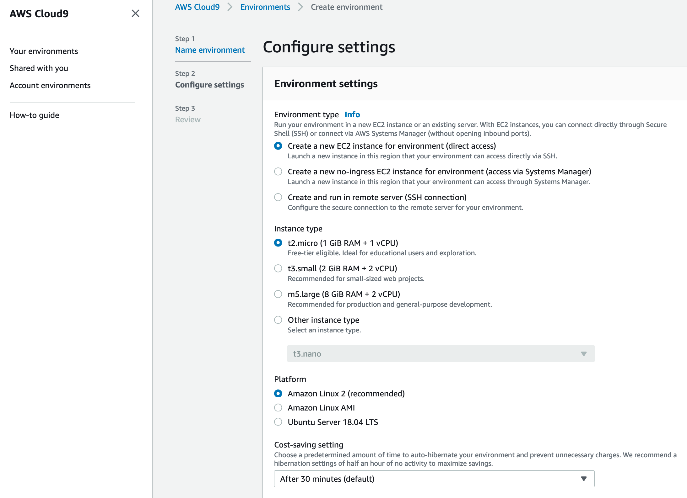

# Optimizing Spring Boot application for AWS Fargate

This project contains the supporting code for the "Optimizing Spring Boot Application for AWS Fargate" blog post. 

# Architecture Overview

The application is available in six different configurations (version seven isn't working anymore, distroless and GraalVM stopped working):

* version 1, not optimized, running on x86_64
* version 2, not optimized, running on ARM64
* version 3, custom JRE and additional optimizations running on x86_64
* version 4, custom JRE and additional optimizations running on ARM64
* version 5, Spring Native (GraalVM AoT compilation) running on X86_64 with Ubuntu 22 parent image
* version 6, Spring Native (GraalVM AoT compilation) running on ARM64 with Ubuntu 22 parent image


# Getting started

To build and deploy this application, you will need the AWS CLI, the [AWS Cloud Development Kit (AWS CDK) V2](https://github.com/aws/aws-cdk), Docker, and [Docker Buildx](https://docs.docker.com/buildx/working-with-buildx/). AWS Cloud9 has all dependencies pre-installed so you deploy it with a single command. It is a cloud-based integrated development environment (IDE) that lets you write, run, and debug your code with just a browser. It comes with the AWS tools, Git, and Docker installed.
Create a new AWS Cloud9 EC2 environment (https://docs.aws.amazon.com/cloud9/latest/user-guide/create-environment-main.html) based on Amazon Linux. Because the compilation process is very memory intensive, it is recommended to select an instance with at least 8 GiB of RAM (for example, m5.large). For building ARM images, an X86 CPU with QEMU can also be used without any problems, but more about that later.



Launching the AWS Cloud9 environment from the AWS Management Console, you select the instance type. Pick an instance type with at least 8 GiB of RAM.

After creation, you are redirected automatically to your AWS Cloud9 environment’s IDE. You can navigate back to your IDE at any time through the [AWS Cloud9 console](https://signin.aws.amazon.com/signin?redirect_uri=https%3A%2F%2Fconsole.aws.amazon.com%2Fcloud9%2Fhome%3Fstate%3DhashArgs%2523%26isauthcode%3Dtrue&client_id=arn%3Aaws%3Aiam%3A%3A015428540659%3Auser%2Fcloud9&forceMobileApp=0&code_challenge=C-AufLUePBN22yMIphjlu96ObOBadc9Z0hK3poSCveQ&code_challenge_method=SHA-256).

All code blocks in this blog post refer to commands you enter into the terminal provided by the AWS Cloud9 IDE. AWS Cloud9 executes the commands on an underlying EC2 instance. If necessary, you can open a new Terminal in AWS Cloud9 by selecting *Window → New Terminal*.

[Modify the EBS volume](https://docs.aws.amazon.com/AWSEC2/latest/UserGuide/requesting-ebs-volume-modifications.html#modify-ebs-volume) of the AWS Cloud9 EC2 instance to at least 20 GB to have enough space for the compilation of your application. Then, reboot the instance using the following command in the AWS Cloud9 IDE terminal, and wait for the AWS Cloud9 IDE to automatically reconnect to your instance.

```
sudo reboot
```

# Build the application

Building the application to an Uber-JAR is very simple, the only dependency is Maven

```
mvn -Dmaven.test.skip=true clean package
```

However, the Maven build is also part of the multi-stage image build, the next section describes how to perform this build process.

# Packaging the application as container image

The complete build of the application is encapsulated in a multi-stage container image which means, that no external dependencies are necessary to build the application. 

```
docker build -f Dockerfile -t <account-id>.dkr.ecr.<region>.amazonaws.com/spring-demo:<tag> .
```

The ARM64 version can be build on a x86_64 CPU using `docker buildx` as well:

```
docker buildx build --platform linux/amd64,linux/arm64 -f Dockerfile --tag <account-id>.dkr.ecr.<region>.amazonaws.com/spring-demo:<tag> --push .
```

# Set up the infrastructure using AWS CDK

After we've built and pushed the Docker image containing the native image of the application, we need to set up the basic infrastructure in eu-west-1

```
$ npm install -g aws-cdk
$ npm install
$ cdk deploy CdkappStack --parameters containerImage=<your_container_image> --context cpuType=<cpuArch>  // Deploys the CloudFormation template
```

The parameter `cpuType` can have either the value `X86_64` or `ARM64`.

# Testing the application

After the infrastructure has been created successfully, the output `LoadBalancerDNS` of the CloudFormation stack is the load balancer URL. You can test the application using the following statements:

```
$ curl -v http://<lb-url>:8080/api/customers // Get a list of all customers
$ curl -v http://<lb-url>:8080/api/customers/<id> // Get customer by id
$ curl -v -d '{"name":"hmueller", "email":"hm@muelle.com", "accountNumber": "243423"}' -H "Content-Type: application/json" -X POST http://<lb-url>:8080/customers // Add a new customer
$ curl -v -X DELETE http://<lb-url>:8080/customers/<id> // Delete customer by id

```

For local development, [DynamoDB Local](https://docs.aws.amazon.com/amazondynamodb/latest/developerguide/DynamoDBLocal.html) can be used. DynamoDB Local is the downloadable version of DynamoDB that lets you write and test applications without accessing the DynamoDB service. Instead, the database is self-contained on your computer. When you are ready to deploy your application in production, you can make a few minor changes to the code so that it uses the DynamoDB service.


# Contributing

Please create a new GitHub issue for any feature requests, bugs, or documentation improvements.

Where possible, please also submit a pull request for the change.
