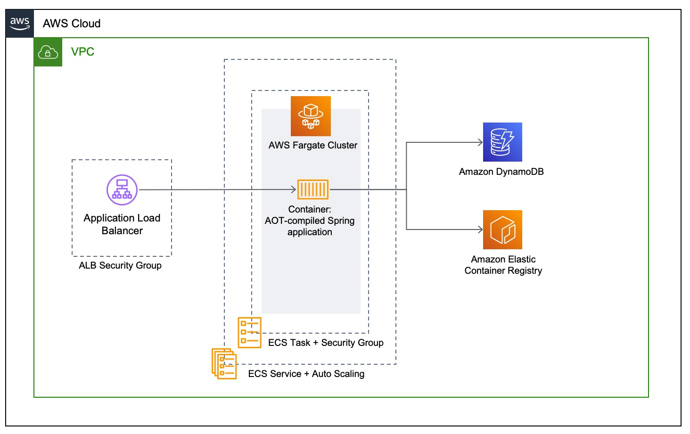

# Optimizing Spring Boot application for AWS Fargate

This project contains the supporting code for the "Optimizing Spring Boot Application for AWS Fargate" blog post. 

# Architecture Overview

The application is available in six different configurations:

* V1: not optimized, for x86_64
* V2: not optimized, for ARM64
* V3: custom JRE and additional optimizations, for x86_64
* V4: custom JRE and additional optimizations, for ARM64
* V5: Spring Native (GraalVM AoT compilation), for X86_64
* V6: Spring Native (GraalVM AoT compilation), for ARM64



# Build the application

Building the application to an Uber-JAR is very simple, the only dependency is Maven

```
mvn -Dmaven.test.skip=true clean package
```

However, the Maven build is also part of the multi-stage image build, the next section describes how to perform this build process.

# Packaging the application as container image

The complete build of the application is encapsulated in a multi-stage container image which means, that no external dependencies are necessary to build the application. 

```
docker build -f Dockerfile -t <account-id>.dkr.ecr.<region>.amazonaws.com/spring-demo:<tag> .
```

The ARM64 version can be build on a x86_64 CPU using `docker buildx` as well:

```
docker buildx build --platform linux/amd64,linux/arm64 -f Dockerfile --tag <account-id>.dkr.ecr.<region>.amazonaws.com/spring-demo:<tag> --push .
```

# Set up the infrastructure using AWS CDK

After we've built and pushed the Docker image containing the native image of the application, we need to set up the basic infrastructure in eu-west-1

```
$ npm install -g aws-cdk
$ npm install
$ cdk deploy CdkappStack --parameters containerImage=<your_container_image> --context cpuType=<cpuArch>  // Deploys the CloudFormation template
```

The parameter `cpuType` can have either the value `X86_64` or `ARM64`.

# Testing the application

After the infrastructure has been created successfully, the output `LoadBalancerDNS` of the CloudFormation stack is the load balancer URL. You can test the application using the following statements:

```
curl -v http://<lb-url>:8080/api/customers/load // Load a list of customers into DynamoDB table
curl -v http://<lb-url>:8080/api/customers // Get a list of all customers
curl -v http://<lb-url>:8080/api/customers/<id> // Get customer by id
$ curl -v -d '{"userName":"hmueller", "firstName":"Hans", "lastName":"Mueller", "age":"35"}' -H "Content-Type: application/json" -X POST http://<lb-url>:8080/customers // Add a new customer
curl -v -X DELETE http://<lb-url>:8080/customers/<id> // Delete customer by id

```

# Contributing

Please create a new GitHub issue for any feature requests, bugs, or documentation improvements.

Where possible, please also submit a pull request for the change.
